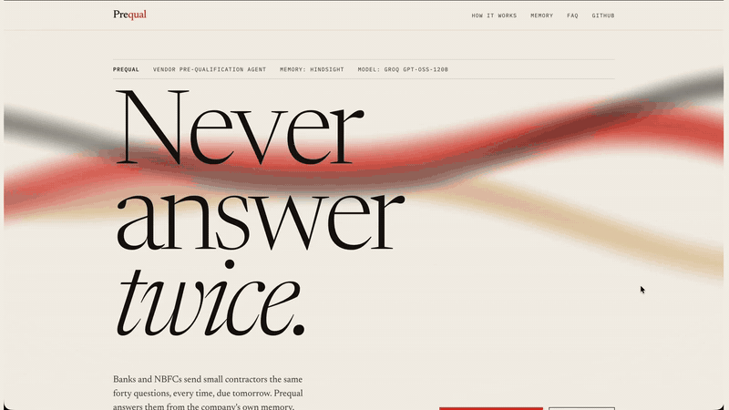

<p align="center">
  
</p>

<p align="center">
  
  
  
  
  
  
</p>

<h3 align="center">Answers vendor pre-qualification questionnaires from the company's own memory.<br>Cites the evidence. Flags what it can't prove. Never invents a certificate.</h3>

<p align="center">
  <a href="https://youtu.be/cmx4w6JXkEw"><b>▶ 2-minute demo</b></a> &nbsp;·&nbsp;
  <a href="https://dev.to/victorisaacchintaeng/my-agent-kept-forgetting-our-company-so-i-gave-it-hindsight-37p3"><b>The write-up</b></a>
</p>

<p align="center">
  <a href="#-see-it">See it</a> ·
  <a href="#-memory-is-the-product">Memory</a> ·
  <a href="#-how-it-works">How it works</a> ·
  <a href="#-it-never-invents-a-certificate">Guardrails</a> ·
  <a href="#-quick-start">Quick start</a> ·
  <a href="#-the-60-second-demo">Demo</a> ·
  <a href="#-api">API</a>
</p>


Small contractors get pre-qualification questionnaires (PQs) from banks, NBFCs, insurers and hospital chains:
30 to 60 questions plus a folder of supporting documents, usually due in days. The answers are almost always the
same as last time, but last time lives in someone's email. So the questionnaire takes days, or never gets
submitted, and the work is lost.

Prequal keeps the company's institutional memory in [Hindsight](https://github.com/vectorize-io/hindsight) and
answers the next questionnaire from it: every fact, every document, every answer ever given, and every correction a
reviewer made. What it cannot back with evidence, it flags as a gap.

> [!NOTE]
> The seed company, **Northstar Interiors**, is fictional. Its identifiers and figures are synthetic, modelled on the
> structure of a real interior fit-out firm and the real questionnaire formats it receives.

## ◆ See it

<p align="center">
  
  <br>
  <sub>The landing page and the review screen after a real run. Full walkthrough with narration: <a href="https://youtu.be/cmx4w6JXkEw">youtu.be/cmx4w6JXkEw</a></sub>
</p>

## ◆ Memory is the product

<p align="center">
  
</p>

With an empty memory bank, Prequal answers nothing and says so. Load the company into Hindsight and the same
questionnaire comes back 38 of 43 answered, each with its source. The four gaps are documents the company does not
hold, so it refuses to claim them.

## ◆ How it works

<p align="center">
  
</p>

<table>
<tr>
<td width="33%" valign="top">

**Automation before AI**<br>
<sub>GSTIN, PAN, address and entity type are looked up. Document requests are checked against the inventory. The model never sees them.</sub>

</td>
<td width="33%" valign="top">

**Every answer shows its source**<br>
<sub>The model must call <code>submit_answer</code> with the evidence IDs it used, or <code>flag_gap</code>. The review screen draws a thread from each answer to the memories it cited.</sub>

</td>
<td width="33%" valign="top">

**It learns from reviewers**<br>
<sub>Every approval and edit is retained with the reviewer's reason. The next client's similar question recalls the corrected answer first.</sub>

</td>
</tr>
<tr>
<td valign="top">

**Facts with dates**<br>
<sub>Turnover is retained once per financial year. Recall returns dated facts, so "last three years" renders as a timeline, newest first.</sub>

</td>
<td valign="top">

**Honest empty state**<br>
<sub>No memory, no answers. A fresh agent sends every question to review instead of filling the silence.</sub>

</td>
<td valign="top">

**Fails safe**<br>
<sub>Bad tool arguments get one retry, then a fallback model, then "needs review". A crash is never an answer.</sub>

</td>
</tr>
</table>

## ◆ It never invents a certificate

<p align="center">
  
</p>

A fabricated certification on a pre-qualification form is worse than no answer. Document questions are answered
deterministically from the inventory, and any free-text draft that claims ISO 9001, an EHS policy, Udyam/MSME
registration or a quality manual the company doesn't hold is pulled out of auto and sent to a human with the reason.


## ◆ How Hindsight is used

Hindsight is the only store of company facts. SQLite holds questionnaires, answers and review state, nothing else.

- **One memory bank per company** (`HINDSIGHT_BANK_ID`), created with a mission and a conservative disposition (skepticism 4, literalism 4).
- **Directives** on the bank: never state a certification or figure that is not in memory; report changed facts as a dated timeline; prefer reviewer corrections.
- **`retain()`** at ingest: company profile facts, one dated fact per financial year for turnover, one fact per document (on file or not held, tagged with the document key), and every past questionnaire answer (tagged `pq:<client>`).
- **`recall()`** per question, scoped by type and tag: financial questions recall world facts tagged `financial` so the UI can build a timeline from `occurred_start`; document questions recall by the document's tag; everything else recalls world, experience and observation memories.
- **`reflect()`** for the pre-answer brief: what the company should know before answering this client's questionnaire.
- **The learning loop**: approvals and edits are retained with the question, the client and the reviewer's reason.
- **Facts that change**: a new year's turnover retained live appears at the top of the timeline on the next run.

## ◆ Quick start

```bash
git clone https://github.com/victorisaacchinta-eng/prequal.git
cd prequal
python -m venv .venv && source .venv/bin/activate
pip install -r requirements.txt
cp .env.example .env        # add HINDSIGHT_API_KEY and GROQ_API_KEY
python scripts/hindsight_smoke.py && python scripts/groq_smoke.py
uvicorn backend.main:app --port 8000 --no-access-log
```

Open **http://localhost:8000** for the landing page and **http://localhost:8000/app** for the review screen.

<details>
<summary><b>No keys? Run it offline</b></summary>

<br>

```bash
PREQUAL_MOCK=1 uvicorn backend.main:app --port 8000
```

The mock memory is an IDF-weighted keyword matcher and the mock drafter pastes the top evidence. It exists for UI
work and as a demo fallback, not as a benchmark.

</details>

<details>
<summary><b>Environment variables</b></summary>

<br>

| Variable | Default | What it does |
|---|---|---|
| `HINDSIGHT_API_KEY` | | Hindsight Cloud key |
| `HINDSIGHT_BASE_URL` | `https://api.hindsight.vectorize.io` | Hindsight endpoint |
| `HINDSIGHT_BANK_ID` | `northstar-interiors` | One bank per company |
| `GROQ_API_KEY` | | Groq key |
| `GROQ_MODEL` | `openai/gpt-oss-120b` | Primary drafting model |
| `GROQ_FALLBACK_MODEL` | `openai/gpt-oss-20b` | Used after rate limits or server errors |
| `PREQUAL_MOCK` | `0` | `1` runs without keys |

</details>

## ◆ The 60-second demo

| Do | Prequal shows |
|---|---|
| **Fresh agent** | Memory bank cleared. "The agent knows nothing about the company." |
| **Run agent** on Prithvi Fincorp | Every question lands in review. Nothing is guessed |
| **Ingest company memory** | Profile, 17 documents and two past questionnaires retained in Hindsight; the live log shows each call |
| **Run agent** again | 38 / 43 answered, 1 for review, 4 gaps. Click any answer to see the threads to its evidence |
| Open the ISO 9001 question | "No. We do not hold an ISO 9001 certificate at present." Marked as a gap |
| **Edit**, then **Approve** | The stamp lands and the correction is retained to memory |
| Switch to **Kestrel Bank**, **Run agent** | The similar question recalls your approved answer |
| **Retain** the FY 2025-26 turnover | Re-draft the turnover question: the new year leads the timeline |

## ◆ Numbers, and where they come from

- **38 auto, 1 needs review, 4 gaps** on the 43-question Prithvi Fincorp questionnaire, one run on 28 Sep 2026 with
  Hindsight Cloud and Groq `gpt-oss-120b`. All four gaps are documents the company does not hold.
- That questionnaire has **15 exact fields, 13 document checks and 15 questions that need judgment**, so the model
  is called for about a third of it.
- Model runs are not deterministic. Treat these as one real run, not a benchmark.

## ◆ Error handling

- Tool arguments are validated with pydantic. Invalid arguments get one retry with the schema echoed back; a second failure becomes `needs review` with the raw text kept.
- A plain-text reply instead of a tool call is `needs review`, never an answer.
- Rate limits and server errors back off, then fall back to `gpt-oss-20b`. If both fail, `needs review` with "click Re-draft in a minute".
- Only the top 8 recalled memories go to the model (the timeline still uses all dated facts), which keeps prompts inside free-tier token limits.
- If Hindsight is unreachable during recall, the answer is `needs review`. If it is unreachable during retain, the memory is queued in SQLite and retried on `POST /api/memory/flush`.

## ◆ API

<details>
<summary><b>Endpoints</b></summary>

<br>

| Method and path | Purpose |
|---|---|
| `POST /api/ingest` | Retain seed data into the bank; build the deterministic caches |
| `POST /api/memory/reset` | Clear the bank (fresh agent) |
| `POST /api/memory/retain` | Retain one fact live |
| `POST /api/memory/flush` | Retry queued retains |
| `GET /api/memory/log` | Recent retain, recall and reflect calls |
| `POST /api/questionnaires/load-samples` | Load the three sample questionnaires |
| `POST /api/questionnaires` | Upload a questionnaire JSON |
| `POST /api/questionnaires/{id}/run` | Run the agent (server-sent events) |
| `POST /api/questionnaires/{id}/brief` | `reflect()` brief |
| `GET /api/questionnaires/{id}` | Questions, answers, evidence, statuses |
| `PATCH /api/answers/{id}` | approve, edit, gap, reopen |
| `GET /api/questionnaires/{id}/export?format=csv` | Final answers |

</details>

## ◆ Repository

```
backend/    main.py (FastAPI), memory.py (Hindsight + mock), agent.py (answer loop, guardrails),
            llm.py (Groq tool calling), db.py (SQLite), ingest.py (seed data)
frontend/   landing.html, index.html (review screen), app.js, styles.css, vendor/ (GSAP)
data/       company profile, document inventory, past answers, three questionnaires
scripts/    hindsight_smoke.py, groq_smoke.py
docs/       article.md, cover.png
```

## ◆ Roadmap

- Parse Excel and PDF questionnaires directly
- Write answers back into the client's own template
- Document expiry alerts, so a solvency certificate never lapses silently

## ◆ Licence

MIT, see [`LICENSE`](LICENSE).


<p align="center"><sub>Built by Sunil Dehru, <a href="https://github.com/victorisaacchinta-eng">Chintha Victor Isaac</a>, Musukula Sri Charan Reddy, Jakula Hari Charan Reddy and Avinash.<br>Memory by <a href="https://github.com/vectorize-io/hindsight">Hindsight</a>. Drafting on <a href="https://groq.com">Groq</a>.</sub></p>
